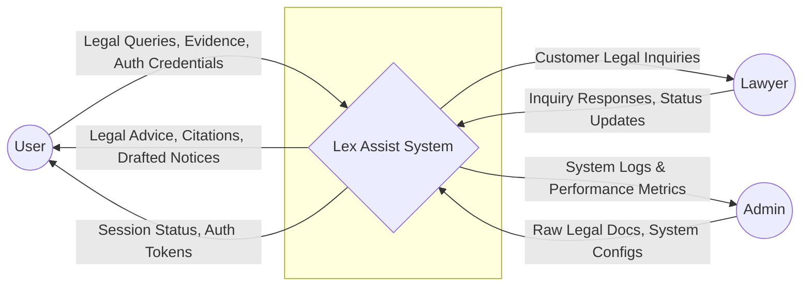
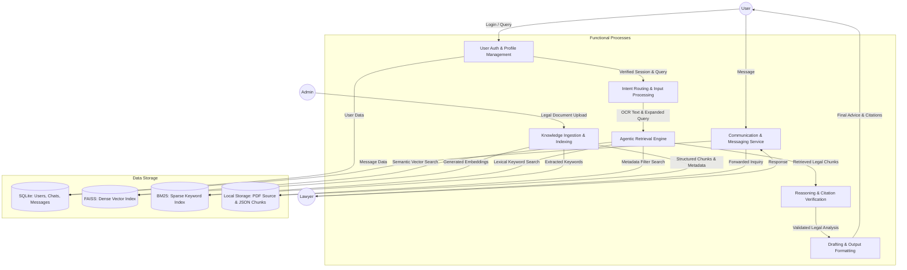

# Lex Assist: System Architecture Diagrams

This document contains the visual representation of the Lex Assist platform's functionality and data flow.

---

## 1. Use Case Diagram
The Use Case Diagram illustrates the high-level functions available to different users of the Lex Assist system and how they interact with the core Agentic RAG engine.

```mermaid
useCaseDiagram
    actor User as "Consumer (User)"
    actor Lawyer as "Legal Expert (Lawyer)"
    actor Admin as "System Administrator"

    User --> (Ask Legal Question)
    User --> (Upload Evidence / OCR)
    User --> (View Legal Advice & Citations)
    User --> (Generate Legal Notice)
    User --> (Chat with Lawyer)
    
    Lawyer --> (Manage Customer Inquiries)
    Lawyer --> (Reply to User)

    Admin --> (Ingest Legal Documents)
    Admin --> (Manage Knowledge Base)
    Admin --> (Monitor System Performance)

    (Ask Legal Question) ..> (Agentic RAG Pipeline) : <<include>>
    (Agentic RAG Pipeline) ..> (Citation Verification) : <<include>>
    (Generate Legal Notice) ..> (Drafting Engine) : <<include>>
```

---

## 2. DFD Level 0: Context Diagram
The Context Diagram defines the boundary between the Lex Assist system and its environment, showing the high-level data exchange with external entities.



---

## 3. DFD Level 1: Process Decomposition
The Level 1 DFD breaks down the system into its primary functional modules and shows how data moves between processes and persistent storage.


