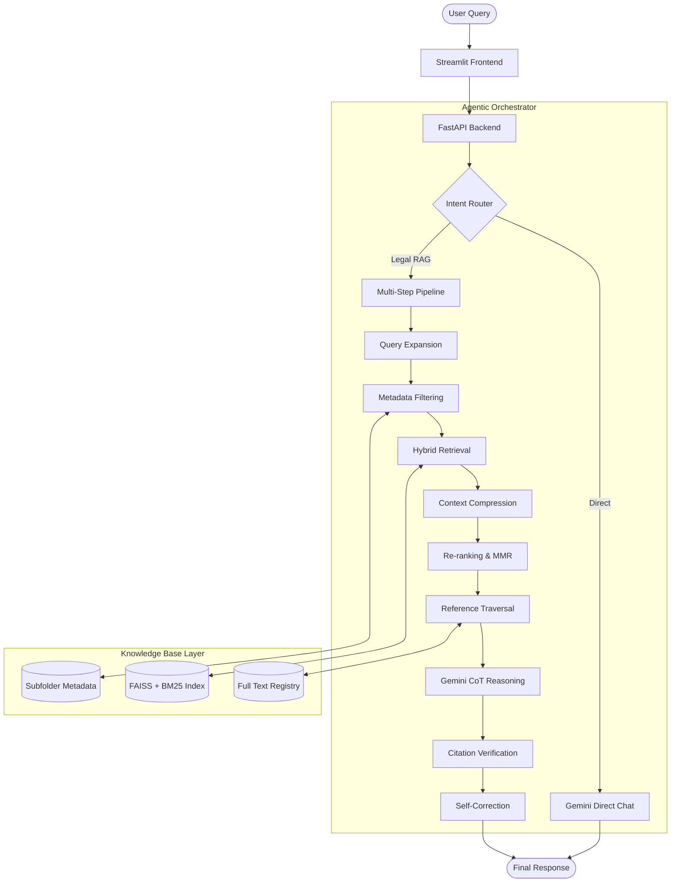

# Project Documentation: Nyaya - Agentic RAG for Consumer Law

This document provides a comprehensive overview of the modules, algorithms, and techniques used in the **Nyaya Agentic RAG system**, designed for Indian Consumer Law.

---

## 1. System Architecture (Data Flow Diagram)

The following diagram illustrates the flow of data from a user query through the multi-step agentic pipeline to the final verified answer.

---

## 2. Modules Overview

| Module | Location | Responsibility |
| :--- | :--- | :--- |
| **Frontend** | `frontend/streamlit_app.py` | UI/UX, chat interface, reasoning trace visualization. |
| **API Gateway** | `app.py` | FastAPI endpoints for querying, ingestion, and drafting. |
| **Orchestrator** | `agent/planner.py` | Manages the 9-step execution flow and intent routing. |
| **Ingestion Engine** | `ingest.py` | Processes PDF/Docx, extracts metadata, and builds indices. |
| **Hybrid Search** | `retrieval/hybrid_search.py` | Combines Vector and Lexical search results. |
| **Query Expansion**| `retrieval/query_expansion.py` | Generates legal synonyms and expanded queries via Gemini. |
| **Metadata Filter**| `retrieval/metadata_filter.py` | Dynamic filtering based on jurisdiction, dates, and domain. |
| **Reranker** | `context/reranker.py` | Uses Cross-Encoders to prioritize the most relevant chunks. |
| **Traversal** | `context/reference_traversal.py`| Follows internal citations (e.g., "Section 12 of Act X"). |
| **Citation Mgr** | `agent/citation.py` | Extracts and validates citations against source text. |
| **Memory Mgr** | `agent/memory.py` | Session-based history and context summary management. |
| **LLM Client** | `llm/gemini_client.py` | Wrapper for Google Gemini (1.5 Flash/Pro) interaction. |

---

## 3. Algorithms & Techniques

### A. Intent Routing (Step 0)
- **Algorithm**: Hybrid Rule-based + LLM Classification.
- **How it's used**: Fast regex checks identify greetings; Gemini handles nuanced legal vs. general intent.
- **Why**: Saves cost and latency by bypassing the RAG pipeline for simple "Hello" or "Who are you?" queries.

### B. Hybrid Retrieval (Step 3)
- **Technique**: Convex Combination (Weighted Sum).
- **Algorithms**: 
    - **FAISS (Vector)**: Semantic search using `all-MiniLM-L6-v2`.
    - **BM25 (Keyword)**: Lexical search for specific legal terms.
- **How it's used**: Merges results from both indices to ensure we catch both "meaning" and "specific keywords."

### C. Context Compression & MMR (Steps 4 & 5)
- **Technique**: Boilerplate Removal + Maximal Marginal Relevance (MMR).
- **How it's used**: Chunks are cleaned of redundant text. MMR ensures that the top-K chunks passed to the LLM are diverse and not repetitive.
- **Why**: Maximizes information density within the LLM's context window.

### D. Reference Traversal (Step 6)
- **Algorithm**: Recursive Lookup.
- **How it's used**: If a retrieved chunk mentions "Section 35 of the Consumer Protection Act," the system automatically fetches that specific section from the knowledge base, even if it wasn't in the initial search results.

### E. Reasoning & Verification (Steps 7, 8, 9)
- **Technique**: Chain-of-Thought (CoT) + Self-Correction Loop.
- **How it's used**: 
    - Gemini generates an answer with explicit **STEP** markers.
    - A citation module extracts and verifies every section mention.
    - If a hallucination is detected (unverified citation), a **Self-Correction Prompt** is sent back to Gemini to fix the error.

### F. Pecuniary Jurisdiction Logic
- **Algorithm**: Threshold-based logic.
- **How it's used**: Automatically identifies the correct forum (District/State/National) based on the user-provided "Claim Value" ($₹$).

---

## 4. Technology Stack
- **Languages**: Python, Javascript (Frontend).
- **LLM**: Google Gemini 1.5 Flash.
- **Vector DB**: FAISS (Local).
- **Frameworks**: FastAPI (Backend), Streamlit (Frontend).
- **Embeddings**: Sentence-Transformers.
- **Document Processing**: PyPDF2, python-docx.
